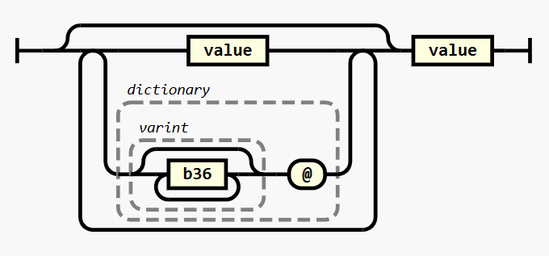

# JSONito

*El sobrinito de JSON*

JSONito (or **Jito** for short) is a close relative of the JSON serialization format — think of it as JSON’s little nephew. While JSON was optimized as a subset of JavaScript, striking a balance between machine-readability and human-friendliness, Jito tips the scales a bit more toward the machine. The result? Documents that are typically **50% smaller**!

Additionally, the character set has been chosen with care to embed seamlessly inside JSON strings, URL query strings, HTTP headers, or anywhere you might want to tuck away a little piece of configuration as text.

## Installation

```sh
$> npm i --save jsonito
```

Or just copy the code to your project.  It's a single typescript file with no dependencies.

## Usage

If you want to jump right on in and use this as a JSON replacement, this module exports `stringify` and `parse` functions.

```ts
import * as JSONito from "jsonito"

const doc = {
  name: "JSONito",
  nickname: "Little Jito",
  new: true,
  magic: 42,
  colors: [..."🟥🟧🟨🟩🟦🟪"],
}

const jito: string = JSONito.stringify(doc)

const decoded: unknown = JSONito.parse(jito)
```

The value is printed with no spaces by default for compactness:

```jito
{name'JSONito'nickname'b~Little Jitonew'!magic'1k.colors'[4~🟥4~🟧4~🟨4~🟩4~🟦4~🟪]}
```

But coming soon is an option to pretty-print as well

```jito
{
  name' JSONito'
  nickname' b~Little Jito
  new' ! 
  magic' 1k.
  colors' [
    4~🟥 4~🟧 4~🟨 4~🟩 4~🟦 4~🟪
  ]
}
```

## Gallery of Samples

|                                       JS |                                JSON | JSONito                   | Comment             |
| ---------------------------------------: | ----------------------------------: | :------------------------ | ------------------- |
|                                      `0` |                                 `0` | `.`                       | Integers            |
|                                     `-1` |                                `-1` | `1.`                      |                     |
|                                      `1` |                                 `1` | `2.`                      |                     |
|                                    `-25` |                               `-25` | `N.`                      |                     |
|                                   `2000` |                              `2000` | `-w.`                     |                     |
|                                `-125000` |                           `-125000` | `Z2f.`                    |                     |
|                                `8654321` |                           `8654321` | `121Ly.`                  |                     |
|                                  `20.24` |                             `20.24` | `3:_g.`                   | Decimal             |
|                                  `1e100` |                             `1e100` | `38:2.`                   |                     |
|                                `-1e-200` |                           `-1e-200` | `6f:1.`                   |                     |
|                                `Math.PI` |                 `3.141592653589793` | `t:mkEokiJF2.`            |                     |
|                           `Math.sqrt(3)` |                `1.7320508075688772` | `v:1X4t8mn8q8.`           |                     |
|                                   `true` |                              `true` | `!`                       | True                |
|                                  `false` |                             `false` | `F!`                      | False               |
|                                   `null` |                              `null` | `N!`                      | Null                |
|                                     `''` |                                `""` | `~`                       | Empty String        |
|                               `'Banana'` |                          `"Banana"` | `Banana'`                 | B64 String          |
|                            `'Hi, World'` |                       `"Hi, World"` | `9~Hi, World`             | String              |
|                                    `'🍌'` |                               `"🍌"` | `4~🍌`                     | UTF-8 String        |
|                           `[ 1, 2, 3 ] ` |                          `[1,2,3] ` | `[2.4.6.]`                | Lists               |
|                      `[ 100, 100, 100 ]` |                     `[100,100,100]` | `38.[***]`                | Lists with Pointers |
|                   `{ a: 1, b: 2, c: 3 }` |               `{"a":1,"b":2,"c":3}` | `{a'2.b'4.c'6.}`          | Maps                |
| `[ { name: 'Alice' }, { name: 'Bob' } ]` | `[{"name":"Alice"},{"name":"Bob"}]` | `name'[{*Alice'}{*Bob'}]` | Repeated Keys       |
|                 `new Map([[1,2],[3,4]])` |                                 N/A | `{2.4.6.8.}`              | Non-string Keys     |

## The Syntax

At its core, Jito's syntax revolves around the `value`. This can encode the same data types as JSON: `string`, `number`, `boolean`, `null`, `map`, and `list`.


Jito does away with delimiters like `:` or `,`, and whitespace is entirely insignificant—giving you the freedom to format as you please. And yes, comments are welcome in Jito's house (even if Uncle JSON wouldn’t allow them).


Containers are still enclosed by `{`, `}`, `[`, and `]`, just like in JSON. However, everything else is prefixed by a Base64 integer followed by a type tag.


One of the key ways Jito reduces encoding size is by allowing repeated values to be written just once and then referenced later. This is achieved by prefixing a value with zero or more other values — each one in the chain can `reference` any previous values.



For even more extreme size compaction, external dictionaries of predefined values can be employed by the encoder. The encoder must assign an ID to the set, which is then included as a `dictionary` value capable of replacing zero or more repeated values.


Finally, while JSON had to be extended with NDJSON to support streaming values, Jito has streaming built right in. Simply insert `;` between documents to delimit them, and feel free to include newlines since they hold no significance in the syntax.

---

Happy encoding with JSONito—the little nephew who’s big on efficiency!
