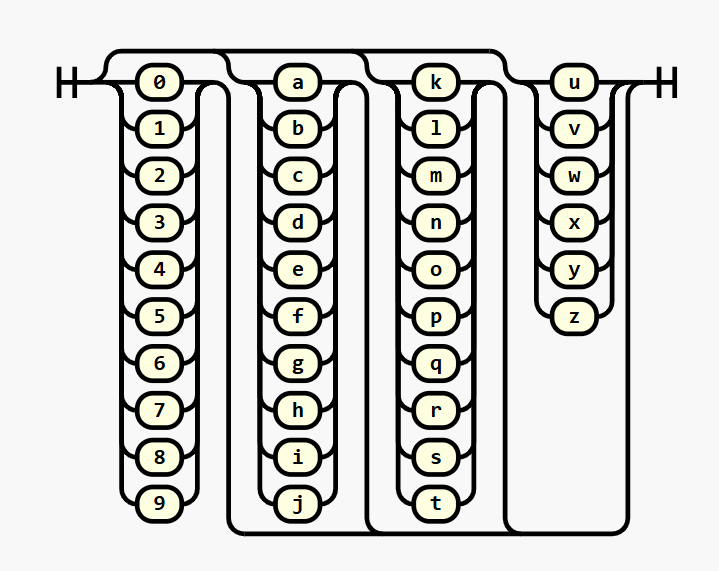

# JSONito


*El sobrinito de JSON*

[](https://github.com/creationix/jsonito/actions/workflows/test.yaml)

JSONito (or **Jito** for short) is a close relative of the JSON serialization format — think of it as JSON’s little nephew. While JSON was optimized as a subset of JavaScript, striking a balance between machine-readability and human-friendliness, Jito tips the scales a bit more toward the machine. The result? Documents that are typically **50% smaller**!

Additionally, the character set has been chosen with care to embed seamlessly inside JSON strings, URL query strings, HTTP headers, or anywhere you might want to tuck away a little piece of configuration as text.

## Installation

This is published to npm as both an ESM and a CJS module, so you can use it with either.

```sh
npm i --save jsonito
```

You can require it from a node CJS script.

```js
const JSONito = require('jsonito')
// or
const { stringify, parse } = require('jsonito')
```

You can import it from a node ESM.

```js
import * as JSONito from 'jsonito'
// or
import { stringify, parse } from 'jsonito'
```

Or just copy the [JS file](dist/jsonito.js) to your website and import it using browser native imports.

```html
<script type="module">
  import * as JSONito from './deps/jsonito.js'
  // or
  import { stringify, parse } from './deps/jsonito.js'
  ...
</script>
```

Or copy the [typescript source](src/jsonito.ts) into your typescript project and import

```ts
import * as JSONito from './deps/jsonito.ts'
// or
import { stringify, parse } from './deps/jsonito.ts'
```

## Usage

If you want to jump right on in and use this as a JSON replacement, this module exports `stringify` and `parse` functions.

```ts
const doc = {
  name: "JSONito",
  nickname: "Little Jito",
  new: true,
  magic: 42,
  colors: [..."🟥🟧🟨🟩🟦🟪"],
}

const jito: string = JSONito.stringify(doc)

const decoded: unknown = JSONito.parse(jito)
```

The value is printed with no spaces by default for compactness:

```jito
{name'7~JSONitonickname'b~Little Jitonew'Tmagic'2c.colors'[2~🟥2~🟧2~🟨2~🟩2~🟦2~🟪]}
```

But coming soon is an option to pretty-print as well

```jito
{ name' 7~JSONito
  nickname' b~Little Jito
  new' T
  magic' 2c.
  colors' [
    2~🟥 2~🟧 2~🟨 2~🟩 2~🟦 2~🟪
  ]
}
```

## Performance

So it's smaller, but by how much you ask?  And does it make parsing slower?

This [benchmark](src/bench.test.ts) measures encoding and decoding a large collection of [public pokemon information](https://pokeapi.co/api/v2/pokemon/) which ends up being around 1 MiB of typical JSON content.

You can see the latest results in every [CI commit](https://github.com/creationix/jsonito/actions/runs/13188729510/job/36817001648#step:4:79) to guage performance over time as we optimize this implementation.

| Metric             | JSON     | JSONito    | Relative Comparison                  |
|--------------------|----------|------------|--------------------------------------|
| **Parse Time**     | 2.67 ms  | 5.09 ms    | JSONito.parse is 1.91x slower        |
| **Stringify Time** | 1.18 ms  | 17.95 ms   | JSONito.stringify is 15.23x slower   |
| **Encoded Size**   | 1.18 MiB | 221.33 KiB | JSONito encoded is 5.46x **smaller** |

## Gallery of Samples

| JS                                       | JSON                                | JSONito                     | Comment             |
|------------------------------------------|-------------------------------------|-----------------------------|---------------------|
| `0`                                      | `0`                                 | `.`                         | Integers            |
| `-1`                                     | `-1`                                | `1.`                        |                     |
| `1`                                      | `1`                                 | `2.`                        |                     |
| `-25`                                    | `-25`                               | `1d.`                       |                     |
| `2000`                                   | `2000`                              | `334.`                      |                     |
| `-125000`                                | `-125000`                           | `5cwf.`                     |                     |
| `8654321`                                | `8654321`                           | `aazfm.`                    |                     |
| `20.24`                                  | `20.24`                             | `3:34g.`                    | Decimal             |
| `1e100`                                  | `1e100`                             | `5k:2.`                     |                     |
| `-1e-200`                                | `-1e-200`                           | `b3:1.`                     |                     |
| `Math.PI`                                | `3.141592653589793`                 | `t:1pv7bhcuvcy.`            |                     |
| `Math.sqrt(3)`                           | `1.7320508075688772`                | `v:9h37r4jzxc8.`            |                     |
| `true`                                   | `true`                              | `T`                         | True                |
| `false`                                  | `false`                             | `F`                         | False               |
| `null`                                   | `null`                              | `N`                         | Null                |
| `''`                                     | `""`                                | `~`                         | Empty String        |
| `'banana'`                               | `"banana"`                          | `banana'`                   | B36 String          |
| `'Hi, World'`                            | `"Hi, World"`                       | `9~Hi, World`               | String              |
| `'🍌'`                                   | `"🍌"`                              | `2~🍌`                      | Unicode String      |
| `[ 1, 2, 3 ]`                           | `[ 1, 2, 3 ]`                      | `[2.4.6.]`                  | Lists               |
| `[ 100, 100, 100 ]`                      | `[ 100, 100, 100 ]`                 | `5k.[***]`                  | Lists with Pointers |
| `{ a: 1, b: 2, c: 3 }`                   | `{"a":1,"b":2,"c":3}`               | `{a'2.b'4.c'6.}`            | Maps                |
| `[ { name: 'Alice' }, { name: 'Bob' } ]` | `[{"name":"Alice"},{"name":"Bob"}]` | `name'[{*5~Alice}{*3~Bob}]` | Repeated Keys       |
| `new Map([[1,2],[3,4]])`                 | N/A                                 | `{2.4.6.8.}`                | Non-string Keys     |

## The Syntax

At its core, Jito's syntax revolves around the `value`. This can encode the same data types as JSON: `string`, `number`, `boolean`, `null`, `map`, and `list`.


Jito does away with delimiters like `:` or `,`, and whitespace is entirely insignificant—giving you the freedom to format as you please. And yes, comments are welcome in Jito's house (even if Uncle JSON wouldn’t allow them).


Containers are still enclosed by `{`, `}`, `[`, and `]`, just like in JSON. However, everything else is prefixed by a Base36 integer followed by a type tag.



One of the key ways Jito reduces encoding size is by allowing repeated values to be written just once and then referenced later. This is achieved by prefixing a value with zero or more other values — each one in the chain can `reference` any previous values.


For even more extreme size compaction, external dictionaries of predefined values can be employed by the encoder. The encoder must assign an ID to the set, which is then included as a `dictionary` value capable of replacing zero or more repeated values.


Finally, while JSON had to be extended with NDJSON to support streaming values, Jito has streaming built right in. Simply insert `;` between documents to delimit them, and feel free to include newlines since they hold no significance in the syntax.

---

Happy encoding with JSONito—the little nephew who’s big on efficiency!
