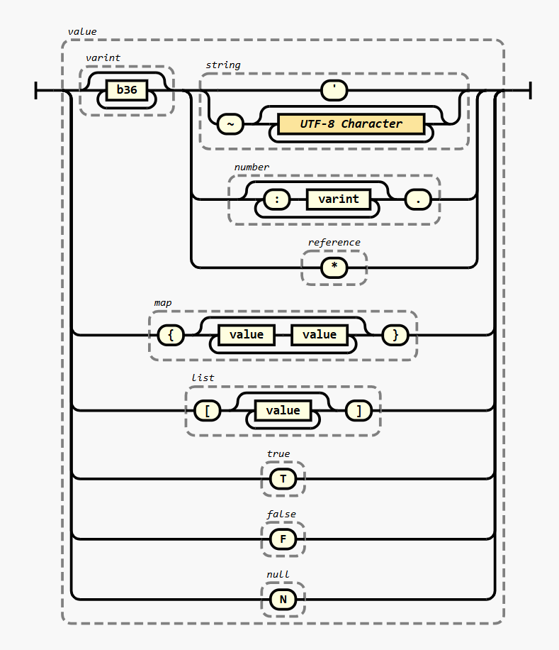

# JSONito

*El sobrinito de JSON*

JSONito (or Jito for short) is a relative of the JSON serilization format.  Think of it as JSON's little nephew.

While JSON was optimized to be a subset of JavaScript and strikes a balance between machine readable and human readable and writable, Jito tips the balance towards the machine and typically ends up with documents 50% smaller.

Also the character set was chosen very carefully to embed well inside JSON strings, URL query strings, HTTP headers, or other places you might want to embed a little piece of configuration as text.

## The Syntax

The core syntax is the `value`.  This encodes the same data types as JSON, namely `string`, `number`, `boolean`, `null`, `map`, and `list`.

Jito does not use any delimeters like `:` or `,` and whitespace is insignificant to allow freedom in formatting.  Comments are allowed in Jito's house even though uncle JSON won't allow them.

Containers are still wrapped with `{`, `}`, `[`, and `]` just like JSON, but everything else is prefixed by a Base64 integer followed by some type tag.

One of the core ways that Jito reduces encoding size is by allowing repeated values to be written once and referenced later.  This is done by prefixing and value with zero or more other values.  Each value in the chain can `reference` previous values.

Also to allow for extreme size compaction, external dictionaries of predefined values can be employed by the encoder.  They do need to assign an ID to those and include that as a `dictionary` value which can replace zero or more shared values.

Finally, while JSON had to be extended with NDJSON to stream values, Jito supports this out of the box.  Simply insert `;` between documents to delimet them.  You can also include newlines if desired as they are insignificant to the syntax.